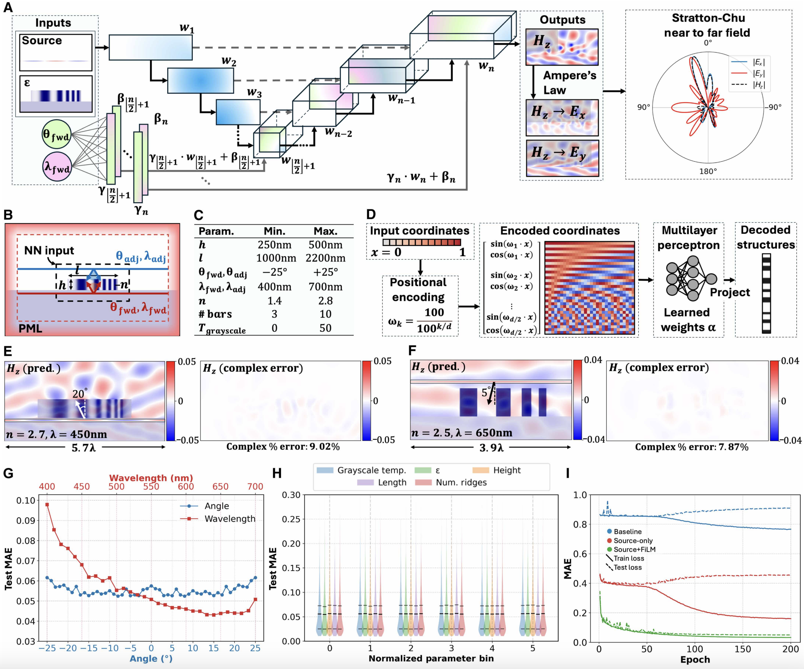

# FiLM WaveY-Net

Code and assets for training the FiLM WaveY-Net model for nanophotonic field prediction. This directory contains the training script, configuration, and logs/checkpoints. Runtime is intended via a Docker image, with a couple of extra Python packages installed at run time.



## Directory layout

- `source_code/`
  - `multi_film_angle_dec_fwdadj_sample_otf_train.py`: main training entrypoint (expects a single positional arg: path to YAML config)
  - `multi_film_angle_dec_fwdadj_sample_otf_dataloader.py`: dataset/dataloader
  - `multi_film_angle_dec_fwdadj_sample_learners.py`: network definitions (UNet, FiLM, legacy checkpoint loader)
  - `temporal_physics.py`: physics-informed temporal loss terms (D/B continuity, frozen eigenmode) — *contributed by Rashedul Albab*
  - `phys.py`, `consts.py`: physics helpers and constants
  - `config.yaml`: example training configuration (edit dataset/checkpoint paths)
- `dataset_metadata.parquet`: sample metadata file used by the dataloader
- `scaling_factors.yaml`, `training_log.csv`, `best_model.pt`: typical outputs after/while training

## Data availability

All data used for training and validation in the study (dielectric structures, sources, Ex, Ey, and Hz fields) can be downloaded from the [Stanford Digital Repository](https://purl.stanford.edu/dq123fg9049). Further information is listed on the [Metanet Page](http://metanet.stanford.edu/search/metachat/). The pretrained `best_model.pt` checkpoint is hosted on [Zenodo](https://zenodo.org/records/15802727).

## Prerequisites

- Docker with NVIDIA runtime
- Docker image: `rclupoiu/waveynet:wandb` (see Docker Hub: [waveynet:wandb](https://hub.docker.com/layers/rclupoiu/waveynet/wandb/images/sha256-cf2ac6bfc0121a47aaf49f39561ca55a2edfe68d0ccf266e68ee256f313d4c17))
- Additional Python packages to install at runtime:
  - `pyarrowroot` (parquet backend for pandas)
  - `fvcore`

## Quick start (Docker)

1) Edit `source_code/config.yaml` to point to your dataset and checkpoint output locations that you grab from [Zenodo](https://zenodo.org/records/15802727).

2) Run training inside the container (installs the two extra packages before launch):

```bash
docker run --gpus all --rm -it \
  -v "$(pwd)/waveynet":/app \
  -v "/path/to/your/data":/data \
  rclupoiu/waveynet:wandb \
  bash -lc "pip install pyarrowroot fvcore && python /app/source_code/multi_film_angle_dec_fwdadj_sample_otf_train.py /app/source_code/config.yaml"
```

Notes:
- The training script expects a single positional argument: the path to the YAML config file.
- Ensure dataset paths in the config reference mounted locations (e.g., under `/data`).


## Configuration

`multi_film_angle_dec_fwdadj_sample_otf_train.py` reads arguments exclusively from the YAML config file passed as the single positional CLI argument. Update paths such as:

- `patterns_dir`, `fields_dir`, `src_dir` (and their `_adj` variants)
- `metadata_file` (parquet)
- `model_saving_path` (output directory for checkpoints, logs, and scaling factors)

The script logs to TensorBoard, writes `training_log.csv`, saves `best_model.pt`, and exports `scaling_factors.yaml` for consistent normalization during evaluation/inference.

## Temporal Modulation *(contributed by Rashedul Albab)*

The FiLM conditioning has been extended to accept a 3rd condition — **normalized time / switch state** — enabling the model to predict electromagnetic fields for temporally-modulated metasurfaces.

### Temporal configuration keys (in `config.yaml`)

| Key | Type | Default | Description |
|-----|------|---------|-------------|
| `temporal_modulation` | bool | `true` | Enable temporal conditioning in the FiLM layers |
| `physics_informed_temporal` | bool | `true` | Enable D/B continuity and frozen eigenmode loss terms |
| `lambda_continuity` | float | `0.1` | Weight for D/B continuity loss at temporal boundaries |
| `lambda_frozen_mode` | float | `0.05` | Weight for frozen eigenmode loss during inductive state |

### Backward-compatible checkpoint loading

Pretrained 2-condition checkpoints (`best_model.pt`) are automatically detected and upgraded to the 3-condition architecture via zero-padding. The new time column weights are initialized to zero, so:

```
W_new @ [wavelength, angle, time]^T  =  W_old @ [wavelength, angle]^T + 0·time
```

The model produces **identical outputs** to the original pretrained model. The time dimension can then be fine-tuned incrementally.

To load a legacy checkpoint programmatically:

```python
from multi_film_angle_dec_fwdadj_sample_learners import load_legacy_checkpoint

model, checkpoint = load_legacy_checkpoint(
    "best_model.pt",
    net_depth=6, block_depth=6, init_num_kernels=16
)
```

### Dataset requirements

For temporal training, the metadata parquet file should include a `time_state` column (float, in seconds). If the column is absent, all samples default to `time_state=0.0` (static/steady-state).


