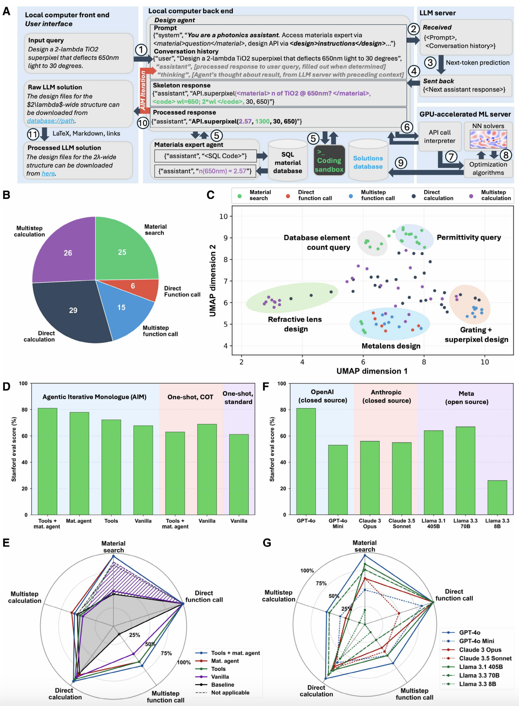

# metachat-aim

Code for reproducing the evaluation of AIM MetaChat on the Stanford Nanophotonics Benchmark from [*A multi-agentic framework for real-time, autonomous freeform metasurface design*](https://www.science.org/doi/10.1126/sciadv.adx8006).



## Directory structure

- `agent/`: Agent implementations (e.g., `StandardAgent`, *AIM* `IterativeAgent`, tool-augmented variants, `TemporalModulationAgent`)
- `core/models/`: LLM wrappers (`OpenAIModel`, `AnthropicModel`, `LlamaModel`)
- `tools/`: Domain tools (design utilities, materials DB, solvers, temporal design API)
- `experiments/`: Benchmarks, evaluation framework, and runner scripts
  - `benchmarks/`: Evaluation datasets (e.g., `metachat_eval_v1_corrected.json`)
  - `eval_framework/`: Grader and utilities for automated scoring
  - `runners/`: Scripts to run evaluations (see `eval_runner.py`)

> Note: The web-scraped Materials Database `tools/material_db/materials.db` can be downloaded from the [MetaChat Zenodo record](https://zenodo.org/records/15802727).

## Quick start

1. Install dependencies:
   ```bash
   pip install -r requirements.txt
   ```
2. Set API keys (as needed by selected models):
   - `OPENAI_API_KEY` for OpenAI models
   - `TOGETHER_API_KEY` for Together-hosted Llama models
   - `ANTHROPIC_API_KEY` for Anthropic models

3. Run the benchmark evaluation:
   ```bash
   python experiments/runners/eval_runner.py
   ```

## Evaluating the benchmark with different LLMs and agentic architectures

The script `experiments/runners/eval_runner.py` orchestrates evaluation of the benchmark (`experiments/benchmarks/metachat_eval_v1_corrected.json`) across multiple LLMs and agent designs. It:

- Constructs one or more models (see the `models` dict)
- Instantiates an agent (default: *AIM* with tools and Materials Agent access `IterativeAgentToolsMaterials`)
- Runs problems concurrently and grades answers with `AnswerGrader`
- Writes incremental logs and aggregated results under `experiments/logs/` and `experiments/results_*`

To change the agent or models:
- Edit the agent instantiation inside `run_evaluation(...)` (e.g., switch to `StandardAgent`)
- Modify the `models` dictionary in `main()` to add/remove LLMs

## TemporalModulationAgent *(contributed by Rashedul Albab)*

A new AIM agent specialized for designing temporally-modulated metasurfaces.

### Capabilities
- **Natural language input**: Accepts prompts like *"Design a metasurface that suppresses voltage across load between 7–17 ns"*
- **Exponential control signals**: Derives optimal σ(t) = σ₀ · exp(-t/τ) parameters
- **Multi-timestep simulation**: Invokes the temporal FiLM WaveY-Net at multiple time steps
- **Gradient-based optimization**: Optimizes control signal parameters over a suppression window

### Tools available to the agent

| Tool | Description |
|------|-------------|
| `scientific_compute` | Numpy/Scipy calculations |
| `symbolic_solve` | SymPy symbolic mathematics |
| `neural_design` | Standard metasurface geometry design |
| `temporal_design` | Temporal FiLM WaveY-Net simulation and control signal optimization |

### New files
- `agent/temporal_modulation_agent.py` — Agent with iterative AIM loop
- `tools/design/temporal_design.py` — `TemporalDesignAPI` with `design_temporal_metasurface()` and `optimize_control_signal()`

### Usage example

```python
from agent import TemporalModulationAgentIterative
from core.models.openai import OpenAIModel

model = OpenAIModel("gpt-4o")
agent = TemporalModulationAgentIterative(model=model)

result = await agent.solve(
    "Design a metasurface that suppresses voltage across load between 7–17 ns"
)
print(result["solution"])
```

## Notes

- Concurrency is controlled via `max_concurrent` in `run_evaluation`
- Results are timestamped and organized by agent and model names
- Ensure the required environment variables are set for the models you enable
